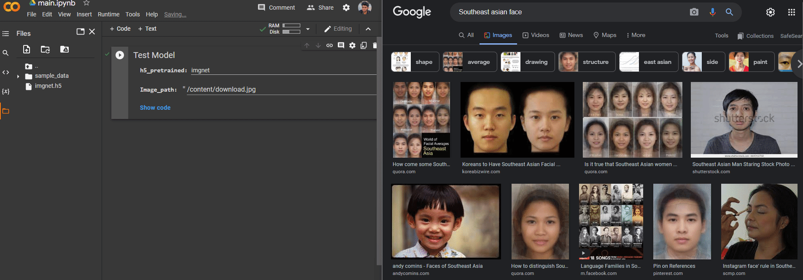

# ImageClassificationTest

# Accuracy
    imgnetPLUSresnet_50_v1
    Test datasets : 24/24 6s 258ms/step - loss: 0.0030 - acc: 1.0000
 

    imagenet - InceptionV3
    Test datasets : 24/24 5s 223ms/step - loss: 0.3469 - acc: 0.8773
 

    resnet_v1_50
    Test datasets : 24/24 4s 167ms/step - loss: 0.2110 - acc: 0.9173
 

    

# Usage

